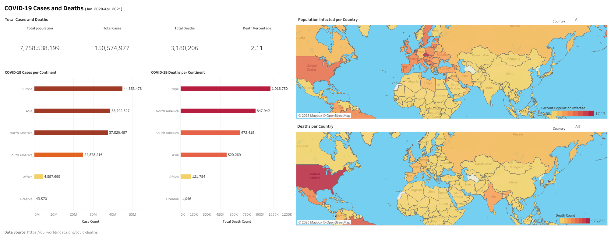

# COVID-19 DATA ANALYSIS

COVID-19 Cases and Deaths (JAN. 2020 - APR.2021)

* Microsoft SQL 
* Microsoft SQL Server Management Studio
* Tableau Public

[Tableau Dashboard](https://public.tableau.com/views/Covid-19Dashboard_17378699911570/Dashboard1?:language=en-US&:sid=&:redirect=auth&:display_count=n&:origin=viz_share_link)

* Total Population Cases, and Deaths
* Covid-19 Cases per Continent
* Covid-19 Deaths per Continent
* Population Infected per Country
* Deaths per Country

Dataset Source: [Coronavirus (COVID-19) Deaths](https://ourworldindata.org/covid-deaths)
